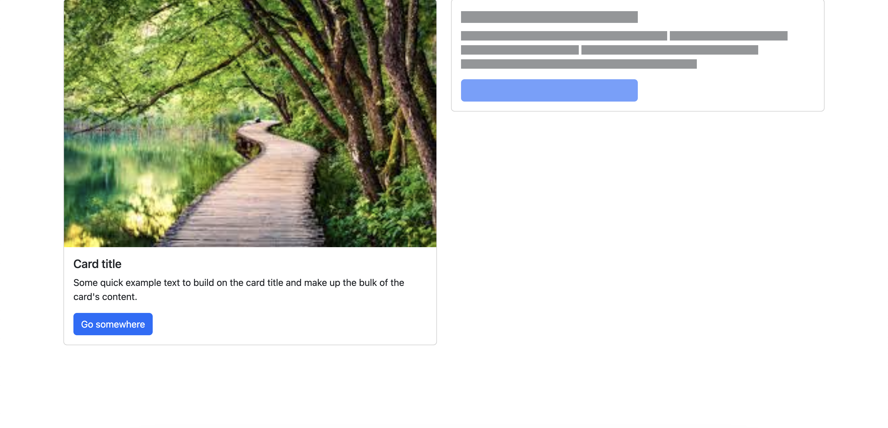
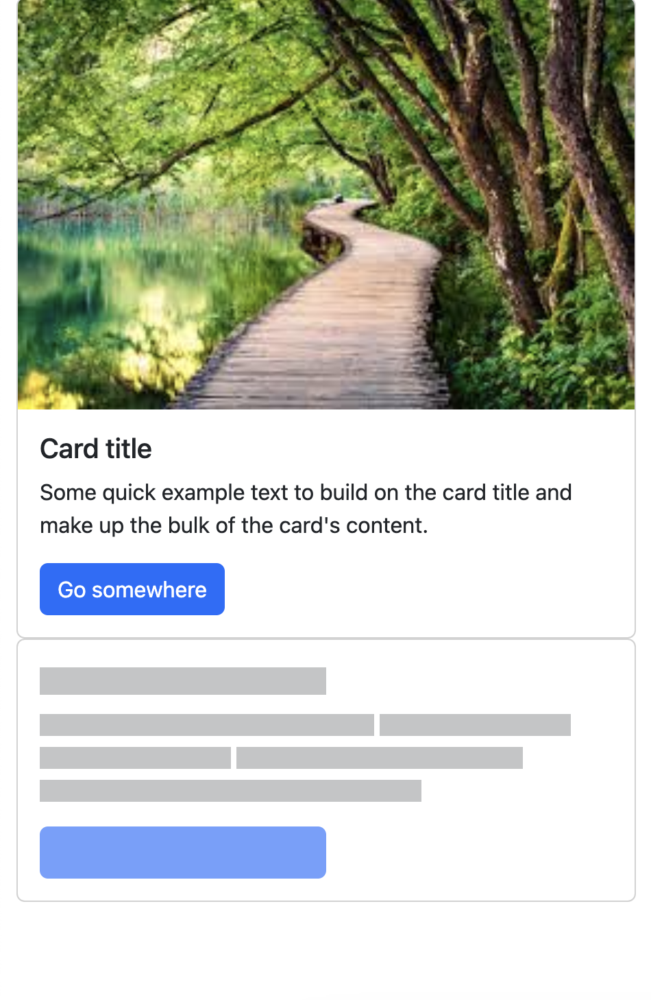

# Практика вебинара "Bootstrap" курса "HTML/CSS" в OTUS

Задание:

1. Склонировать репозиторий или скопировать содержимое файла index.html.
2. Добавить в body на месте комментария

   ```html
   <!-- Добавьте сюда карточку и модаль -->
   ```

   [карточку](https://getbootstrap.com/docs/5.3/components/card/) с вашим именем и названием курса.
3. Добавить [рядом](https://getbootstrap.com/docs/5.3/components/placeholders/) карточку с плейсхолдером.
4. Карточки должны находиться в одной строке, при уменьшении размера экрана до планшета (брейкпоинт `md`), карточки выстраиваются в столбик.

Пример того, как это может выглядеть:




